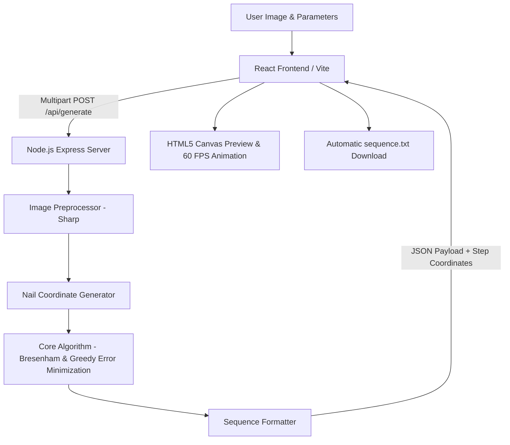

# 🧶 StringArt — ERN Stack & C++ Engine

<p align="center">
  
  
  
  
  
  
</p>

<p align="center">
  <b>Transform raster images into intricate circular thread art with mathematical precision.</b><br>
  Featuring a high-performance <b>Full-Stack ERN (Express, React, Node.js)</b> web application alongside the original <b>C++ OpenCL CLI engine</b>.
</p>

---

## 📸 Gallery & Showcase

| Source Image | Color String Art | Monochromatic / Gray |
| :---: | :---: | :---: |
|  |  |  |

---

## ✨ Features

- **High-Performance Algorithm**: Ported from C++ to Node.js using flat typed arrays (`Uint8Array`, `Float64Array`) and integer-only Bresenham calculations for maximum compute speed.
- **Interactive Canvas Visualization**: HTML5 canvas rendering powered by `requestAnimationFrame` with batch line drawing, speed sliders (up to 10x), play/pause, and real-time step inspection.
- **Hardware & Sequence Export**: Generates and downloads plain-text instruction files (`sequence.txt`) compatible with physical CNC string art machines or manual DIY knitting boards.
- **Image Preprocessing**: Built-in resizing, brightness adjustment, linear contrast tuning, and background luminance clipping powered by [Sharp](https://sharp.pixelplumbing.com/).
- **Customizable Parameters**:
  - Nail count (distribution around circular perimeter)
  - Max iterations (number of string passes)
  - Density penalty ($k_{density}$) to prevent over-darkening hot spots
  - Alpha blending values for thread opacity
  - Multi-color thread support (RGB palettes)
- **Glassmorphic UI**: Sleek, modern dark-mode interface built with Vanilla CSS without heavy component library overhead.

---

## 🏗️ System Architecture



### 1. The Client (`client/`)
- **React 18 & Vite**: Fast bundling and modular architecture.
- **Custom Hook (`useStringArt`)**: Centralized state management handling file uploads, parameter forms, generation progress, and automated Blob downloads.
- **Optimized Canvas Renderer**: Uses `useRef` directly to isolate heavy drawing loops from the React render lifecycle.

### 2. The Server Engine (`server/engine/`)
- **Image Preprocessing (`imageProcessor.js`)**: Normalizes input images into square dimensions (default 512×512) and extracts flat RGBA pixel buffers.
- **Nail Generator (`nailGenerator.js`)**: Distributes $N$ nails uniformly around an inscribed ellipse/circle:
  $$\begin{aligned} x &= c_x + r_w \cdot \cos(\theta) \\ y &= c_y + r_h \cdot \sin(\theta) \end{aligned}$$
- **Score Calculator (`scoreCalculator.js`)**: Greedy residual-error reduction using Bresenham's line algorithm. Evaluates all candidate nails from the current nail and picks the path that delivers the maximal squared-error reduction:
  $$\Delta \text{Error} = (I_{\text{orig}} - I_{\text{blend}})^2 - (I_{\text{orig}} - I_{\text{curr}})^2$$
- **Sequence Formatter (`sequenceFormatter.js`)**: Outputs standard metadata and line sequence instructions (`R G B nail_index`).

---

## 📂 Project Structure

```text
StringArt/
├── assets/                  # Example source and output images
├── client/                  # React + Vite frontend application
│   ├── src/
│   │   ├── components/      # Controls, CanvasPreview, ImageUpload
│   │   ├── hooks/           # useStringArt state hook
│   │   ├── App.jsx          # Root dashboard
│   │   └── index.css        # Vanilla CSS glassmorphism design system
│   └── package.json
├── server/                  # Express + Node.js computation backend
│   ├── engine/              # Image processing, nail generator, scoring engine
│   ├── index.js             # API routes and server configuration
│   └── package.json
├── kernels/                 # OpenCL kernel files (C++ engine)
├── src/                     # C++ source code
├── CMakeLists.txt           # CMake build configuration for native C++ binary
├── main.cpp                 # C++ main entry point
├── package.json             # Root monorepo workspace runner
└── README.md
```

---

## 🚀 Quick Start (Web Application)

### Prerequisites
- [Node.js](https://nodejs.org/) (v18.0.0 or higher recommended)
- `npm` (comes with Node.js)

### Installation

Clone the repository and install dependencies for both client and server:

```bash
git clone https://github.com/syed-awais-shah-tech/StringArt.git
cd StringArt

# Install dependencies for both server and client
npm install --prefix server
npm install --prefix client
```

### Running Locally

You can launch both the backend server and frontend client from the root directory:

```bash
# Run both server & client concurrently (Windows)
npm run dev
```

Or run them individually in separate terminals:

```bash
# Terminal 1 - Backend Server (runs on http://localhost:3001)
npm run server

# Terminal 2 - Frontend Client (runs on http://localhost:5173)
npm run client
```

Open [http://localhost:5173](http://localhost:5173) in your browser to start generating string art!

---

## ⚡ Native C++ Engine (Optional)

If you wish to compile and run the native high-performance C++ CLI implementation:

### Requirements
- CMake 3.15+
- C++17 compatible compiler (`g++`, `clang++`, or MSVC)
- OpenCL drivers / SDK

### Build Instructions
```bash
cmake -S . -B build -DCMAKE_BUILD_TYPE=Release
cmake --build build --config Release
```

### C++ CLI Usage
```bash
./StringArt -ii assets/input.png -oi assets/output.png -n 300 -it 5000 -kd 500 -a 0.13
```

Run `./StringArt -h` to see all available CLI options.

---

## 📄 Sequence File Format

The exported `.txt` sequence file follows this standard structure:

```text
StringBoard Sequence File
Nails: 200
Lines: 4000
Dimensions: 512 512
Sequence:
0 0 0 45
0 0 0 128
...
```
Each line in the sequence section specifies `[Red] [Green] [Blue] [TargetNailIndex]`.

---

## 📜 License

This project is licensed under the [GNU General Public License v3.0](LICENSE).
